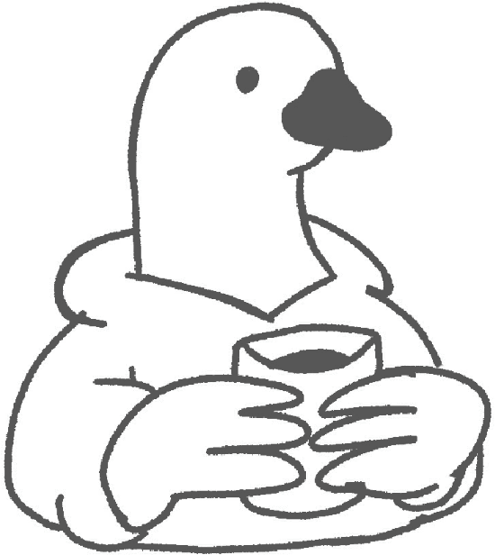

# Proyecto PAUSA (UMAG)

Repositorio del **Proyecto PAUSA** (Universidad de Magallanes) donde se ejecutan encuestas de un estudio longitudinal sobre **adaptación/experiencia universitaria y bienestar estudiantil**.

## Qué hace este repo
- Las encuestas (formularios) están definidas en `surveys/` como archivos JSON.
- El sitio público corre la encuesta en `index.html` y `js/surveyRunner.js`.
- Se guarda el resultado en **Firestore (Firebase)** bajo `responses/<surveyId>/entries`.
- Hay un panel de exportación en `admin.html` que descarga los datos en CSV (incluye respuestas y, opcionalmente, metadatos/paradata).

## Contacto
Para dudas del estudio o de la encuesta:

- `pausa@umag.cl`

## Documentación para quienes editen encuestas
- Convenciones y “contrato” del JSON: `docs/SURVEY_JSON_CONVENTIONS.md`
- Arquitectura: `docs/ARCHITECTURE.md`
- Ideas de mejora: `docs/IMPROVEMENT_QUESTIONS.md`
